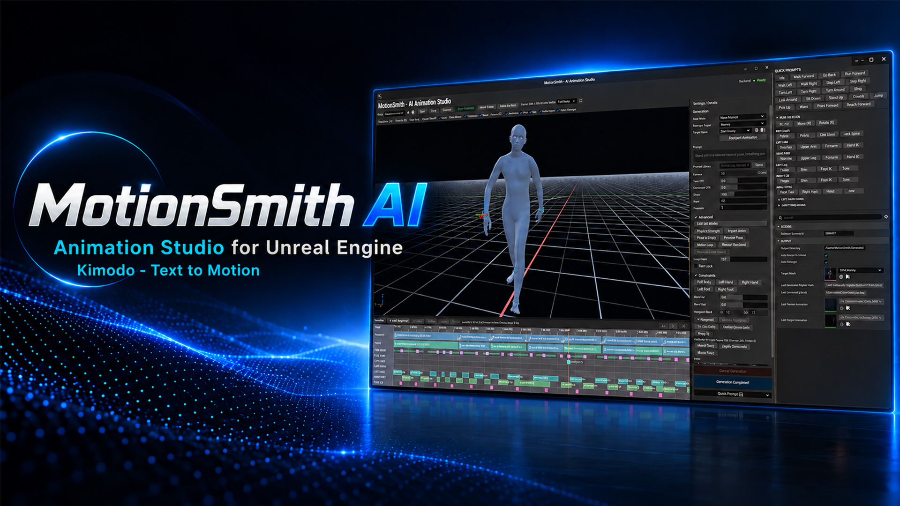

# MotionSmith AI Animation Studio

MotionSmith 1.0.0 is an AI-assisted 3D character animation authoring plugin for Unreal Engine 5.8 on Windows. It brings motion generation, continuation, editing and retargeting into Unreal Editor.

[Fab listing](https://www.fab.com/listings/21c531e5-02b0-4d4a-960d-8cceab5dba34) · [Documentation](https://motionsmithai.blogspot.com/p/docs.html) · [Tutorials](https://motionsmithai.blogspot.com/p/tutorials.html)

## What you can do

- Generate character motion from a natural-language action prompt.
- Build a longer performance by adding segments on the MotionSmith timeline.
- Import an Unreal `AnimationSequence` and continue from the end of its motion.
- Adjust motion with transform, pose and authoring controls; use props as scene references.
- Retarget to the included UE5 Manny/Quinn, MetaHuman, Character Creator and Mixamo workflows.
- Export a standard Unreal `AnimationSequence` for Sequencer, Montages or Animation Blueprints.

## Requirements

| Component | Requirement |
| --- | --- |
| Unreal Engine | 5.8, Windows 64-bit |
| Unreal plugin | IK Rig enabled |
| GPU | NVIDIA GPU with CUDA support for local AI inference |
| MotionSmith Runtime | Version 1.0.0, installed separately |
| Text model | Meta Llama 3 8B Instruct, obtained separately under Meta's terms |

Allow enough disk space for the separate Runtime and model files. The plugin ZIP contains neither the Runtime nor Meta Llama weights.

## Install the GitHub plugin package

1. Download `MotionSmith_1.0.0.zip` from [Releases](https://github.com/webportalim/MotionSmith-Kimodo-Animation-Studio/releases) once version `v1.0.0` is published.
2. Extract the archive so your Unreal project contains `Plugins/KimodoMotion/KimodoMotion.uplugin`.
3. Enable **IK Rig** in Unreal Engine. Open the project with Unreal Engine 5.8; this source plugin may need to compile for your project.
4. Download [MotionSmith Runtime 1.0.0](https://huggingface.co/Serqan/MotionSmith-Runtime/tree/main/releases/1.0.0). Extract its ZIP manually to `%LOCALAPPDATA%\MSR\`. Confirm `%LOCALAPPDATA%\MSR\runtime.json` exists.
5. Obtain [Meta Llama 3 8B Instruct](https://huggingface.co/meta-llama/Meta-Llama-3-8B-Instruct) separately. In **Editor Preferences > Plugins > MotionSmith**, set **Meta Llama Folder** to the downloaded model directory and click **Rescan**.
6. When the Runtime and model statuses show **READY**, run **Diagnostics / Pre-Flight** before generating motion.

The GitHub 1.0.0 plugin ZIP does not automatically download or install the Runtime or Meta Llama model. No Hugging Face token is requested or stored by this package.

## What is in each download

- **Plugin ZIP (this repository):** `KimodoMotion` Unreal Editor plugin source, content and configuration.
- **Separate Runtime ZIP:** Python, PyTorch/CUDA, MotionSmith/Kimodo backend, Kimodo-SOMA-RP-v1.1 and LLM2Vec adapters.
- **Separate Meta download:** Meta Llama 3 8B Instruct model files.

MotionSmith performs AI inference locally after these components are installed. It is an independent product built with NVIDIA Kimodo technology and is not affiliated with or endorsed by NVIDIA.

## Help and terms

- [Installation documentation](https://motionsmithai.blogspot.com/p/docs.html)
- [Fab product page](https://www.fab.com/listings/21c531e5-02b0-4d4a-960d-8cceab5dba34)
- Support: motionsmithai@gmail.com

Free availability does not by itself grant permission to modify or redistribute the plugin or bundled assets. No open-source license is declared in this repository. The separately downloaded Runtime and Meta Llama model have their own license terms.
